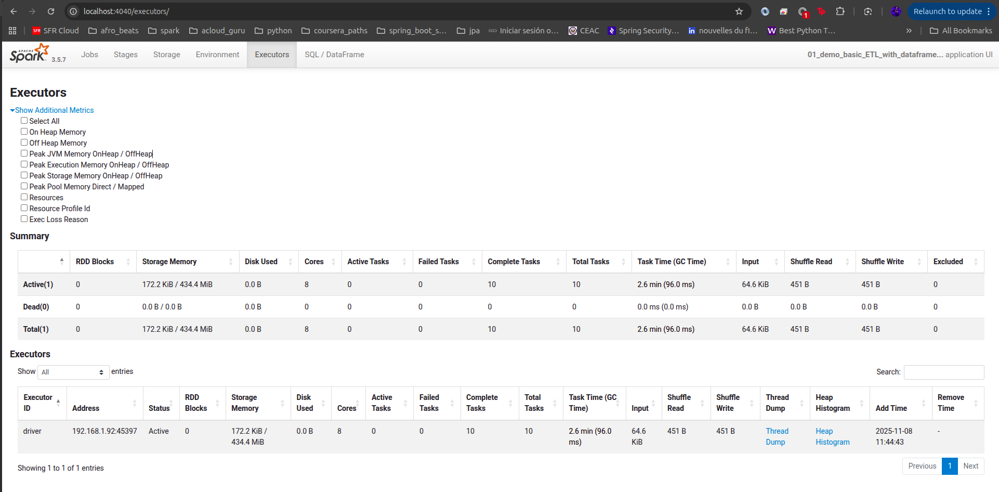

# Tips

## Error found on caching the DataFrame while running on Pycharm

```python
from pyspark.sql import SparkSession

spark = SparkSession.builder.appName("01_demo_basic_ETL_with_dataframe_api").getOrCreate()

flights_df = spark.read.format("parquet").load("flights_1988_2008.parquet")
flights_df.cache()
print(flights_df.schema)
print(flights_df.inputFiles())  # not an action but metadata query instead
# flights_df.printSchema()
print(flights_df.count())
```

```text
java.lang.OutOfMemoryError: Java heap space
```

This error means the JVM running Spark ran out of heap memory — the part of memory used to store objects, cached RDDs,
DataFrames, and shuffle data (the memory inside JVM used for all runtime objects)

### cause

Spark is trying to load or cache a large Parquet file (flights_1988_2008.parquet) into memory, and the local machine (or
PyCharm JVM) doesn’t have enough RAM allocated

In simple terms:

- Spark is running on a low-memory device or with too little heap allocated to the Spark driver/executor.

### why

- By default, Spark (in local mode) gives the driver only ~1 GB of JVM heap.
- The dataset flights_1988_2008.parquet is hundreds of MBs (582)
- When Spark tries to:
    - Cache or sort data (ORDER BY)
    - Collect data to the driver (e.g. .show() pulls data to local)
    - Build statistics or columnar batches it can quickly exceed that memory limit.
- When Spark reads a Parquet file, it decompresses and deserializes the data into JVM memory. 582 MB on disk can expand
  to 2–4 GB in memory, depending on column encoding and compression.
- (Local) Both the driver and executor share the same JVM heap. Default: ~1 GB (spark.driver.memory=1g).
- Even show(10) triggers execution; if a query has ORDER BY or aggregation, Spark may sort/aggregate the entire dataset
  before slicing to 10 rows.
- The stack trace shows Spark building column stats and cached batches — those can momentarily hold several copies of
  your dataset.

## How to measure the Real Spark (JVM) Memory

- Note: checking the used memory before and after the action in python is fouling since data are sent to JVM

To check the real memory usage in JVM :

- go to the Spark Web UI (http://localhost:4040)
- Executors tab -> shows memory used by driver/executor
- Storage tab --> shows cached DataFrames and their in-memory sizes
- SQL tab --> shows query execution details

## Interpretation of the Spark Web UI

### Executors tab



It running Apache Spark 3.5.7 locally (master=local[*]), meaning the driver and executor are the same JVM process.
So the single active executor (driver) in your UI represents both the driver and the only executor thread pool.

#### Summary table break down

| Metric                   | Meaning                                                   | Your Value            | Expert Interpretation                                                                                                                                                                            |
|--------------------------|-----------------------------------------------------------|-----------------------|--------------------------------------------------------------------------------------------------------------------------------------------------------------------------------------------------|
| **RDD Blocks**           | Cached RDD/DataFrame blocks in memory                     | 0                     | You haven’t called `.cache()` or `.persist()` yet.                                                                                                                                               |
| **Storage Memory**       | Memory used for cached data / total reserved cache memory | 172.2 KiB / 434.4 MiB | Spark has a 1 GB JVM heap. Of that, ≈ 434 MB (≈ 0.6×(1 GB – 300 MB)) is Spark’s *unified memory pool* for execution + storage. Only ~172 KB of it is actually used — almost no caching activity. |
| **Disk Used**            | Spill files from shuffles or cached blocks on disk        | 0.0 B                 | No spilling; all data fits comfortably in memory. Excellent performance.                                                                                                                         |
| **Cores**                | CPU cores allocated to Spark tasks                        | 8                     | Running `local[*]`, Spark is using all 8 CPU threads of your machine.                                                                                                                            |
| **Active Tasks**         | Tasks currently running                                   | 0                     | Job finished; no tasks running.                                                                                                                                                                  |
| **Failed Tasks**         | Tasks that crashed                                        | 0                     | Perfect — no failures.                                                                                                                                                                           |
| **Complete Tasks**       | Tasks finished successfully                               | 10                    | 10 tasks executed and completed successfully.                                                                                                                                                    |
| **Total Tasks**          | Sum of active + complete + failed tasks                   | 10                    | Matches above — job finished cleanly.                                                                                                                                                            |
| **Task Time (GC Time)**  | Total CPU time and garbage collection time                | 2.6 min (96 ms)       | Spark tasks ran for 2.6 min total CPU time; GC took only 0.1 s (≈ 0.06 %) → no memory pressure.                                                                                                  |
| **Input**                | Total data read from source                               | 64.6 KiB              | Small dataset, likely from `.show()`, `.count()`, or a small sample.                                                                                                                             |
| **Shuffle Read / Write** | Data exchanged between tasks during wide transformations  | 451 B / 451 B         | Negligible shuffling — no joins or aggregations requiring heavy data exchange.                                                                                                                   |
| **Excluded**             | Tasks skipped due to errors                               | 0                     | Clean run — no excluded tasks.                                                                                                                                                                   |

##### Storage Memory explained in details where the magic 434 MB comes from

- Start with the driver JVM heap
  `spark.driver.memory = 1g → 1 GB = 1024 MB of JVM heap.`
- Subtract Spark’s “reserved” memory (fixed 300 MB)
  Reserved memory is a small, fixed amount of JVM heap that Spark keeps aside from each executor to ensure the system
  does not crash completely when the rest of the memory is used up.
  Spark keeps a fixed chunk for miscellaneous JVM needs (parsing, user code, metadata, etc.).
- Usable heap for Spark’s memory manager
  `= 1024 MB − 300 MB = 724 MB.`
- Apply the unified-memory fraction (default 0.6)
  Unified memory is the Spark-managed portion of the JVM heap that combines execution memory (for running tasks like
  joins and shuffles) and storage memory (for caching and broadcasting data) into a single shared pool. Introduced in
  Spark 1.6+, this unified model allows dynamic sharing between execution and storage, improving flexibility and overall
  memory efficiency.
  `spark.memory.fraction = 0.6` determines how much of that usable heap becomes the unified pool (execution + storage).
  `Unified pool = 0.6 × 724 MB = 434.4 MB → ≈ 434 MB.`
    - Inside the unified pool: execution vs storage (initial boundary)
        - `spark.memory.storageFraction = 0.5` sets the initial split.
        - Storage (caching/broadcast) ≈ 0.5 × 434.4 ≈ 217.2 MB
        - Execution (shuffle/joins/aggregation) ≈ 0.5 × 434.4 ≈ 217.2 MB
        - These two can borrow from each other at runtime (execution usually has priority).
        - Your observation: “Only ~172 KB used”
        - That number is the current usage inside the unified pool (almost nothing is cached and very little execution
          memory is
          needed at that instant).
        - So: pool size ≈ 434 MB, current used ≈ 172 KB → pool is basically idle.
- What about the rest of the usable heap?
  The non-unified memory region is the portion of the JVM heap that Spark does not manage directly. It is used by
  user-defined objects created in transformations or UDFs, by Spark’s own internal bookkeeping structures (such as task
  metadata, shuffle tracking, and metrics), and by general JVM overhead like thread stacks and garbage-collection data.
  `= 0.4 × 724 MB = 289.6 MB → ≈ 290 MB.`

#### Executors Section

| Field              | Value                 | Explanation                                                |
|--------------------|-----------------------|------------------------------------------------------------|
| **Executor ID**    | `driver`              | The single executor used by the driver JVM (local mode).   |
| **Address**        | `192.168.1.92:45397`  | Local host network interface used for Spark’s RPC.         |
| **Status**         | Active                | Executor currently alive and available.                    |
| **Storage Memory** | 172.2 KiB / 434.4 MiB | Confirms the same unified memory pool and low cache usage. |
| **Cores**          | 8                     | Matching your machine’s core count.                        |
| **Add Time**       | `2025-11-08 11:44:43` | When the executor was launched.                            |
| **Remove Time**    | `–`                   | Executor still active.                                     |

#### Health Summary

| Category        | Observation                  | Conclusion                                     |
|-----------------|------------------------------|------------------------------------------------|
| **Memory**      | 434 MB pool, 0.17 MB used    | Spark healthy, no caching or pressure.         |
| **CPU**         | 8 cores used, 0 active tasks | Fully utilized threads, idle after completion. |
| **Disk I/O**    | 0 B spill                    | Perfect — all fits in RAM.                     |
| **GC Overhead** | 96 ms / 2.6 min              | Negligible (≈ 0.06 %) — JVM efficient.         |
| **Tasks**       | 10 total, 0 failed           | Successful parallel execution.                 |

#### Final Pro Assessment

- Spark is configured correctly and performing optimally for local mode
- dataset is tiny (~ 65 KB read), so Spark's memory and shuffle systems are barely engaged.
- Unified Memory (434 MB) indicates default memory management (60% of heap after 300MB reserved)
- No spills, no GC pressure, no failure -> Spark is in excellent health
- For larger data, we can increase memory with :

```python
spark = SparkSession.builder \
    .config("spark.driver.memory", "4g") \
    .getOrCreate()
```

## Memory optimization

When Spark reads a 582 MB Parquet file, it doesn’t stay 582 MB in memory:

| Compression                 | Typical Expansion Ratio | In-Memory Size Estimate |
|-----------------------------|-------------------------|-------------------------|
| Snappy (default in Parquet) | ×3 – ×4                 | ≈ 1.7 – 2.3 GB          |
| GZIP                        | ×4 – ×6                 | ≈ 2.3 – 3.5 GB          |
| Uncompressed                | ×1 – ×2                 | ≈ 600 MB – 1.2 GB       |

Then add temporary overhead:

- Shuffle, caching, column statistics, and wide transformations can need 1.5×–2× extra

## Dimensioning the RAM

We've seen about spark memory optim, but what about the material itself, a computer needs its own memory to perform
so for that we should reserve some part of the RAM memory for OS internal stuff

- for VM 500 - 1000 MB, so if the computer have 4 GB, we let 1 for the system itself and adding max(384MB and 10 porcent
  of heap memory for pyspark)
    - it gaves us a 2.6 MB assigned for heap
- for docker, pod 256 MB, same applies here 


